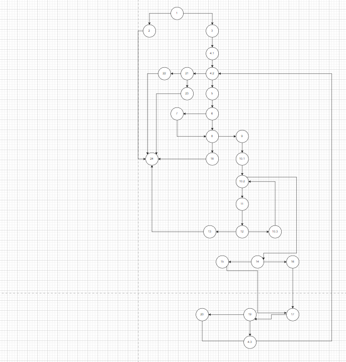

Виолета Крстева, 225068

Control Flow Graph

Цикломатска комплексност
Цикломатската вредност е 10 и ја добив со помош на Control Flow Graph, преку формулата V(G) = E–N+ 2, каде Е е бројот на врски (рабови) во графот, а N број на јазли. 28 јазли 36 ребра V(G) = 36-28+2=10

Тест случаи според критериумот Every branch
@Test void EveryBranchTest(){

first test case - empty list
RuntimeException ex;
ex = assertThrows(RuntimeException.class, () -> SILab2.checkCart(null, 100));
assertTrue(ex.getMessage().contains("allItems list can't be null!"));

second test case - character in barcode
ex = assertThrows(RuntimeException.class, () -> SILab2.checkCart( createItems(new Item("FirstItem", "80c", 13, 0)),100));
assertTrue(ex.getMessage().contains("Invalid character in item barcode!"));

third test case - name is null
assertTrue(SILab2.checkCart( createItems(new Item(null, "180", 100, 0)),150));

fourth test case - no barcode
ex = assertThrows(RuntimeException.class, () -> SILab2.checkCart( createItems(new Item("Item0", null, 100, 0)),100));
assertTrue(ex.getMessage().contains("No barcode!"));

fifth test case - all good - return false
assertFalse(SILab2.checkCart( createItems(new Item("Item1", "021", 360, 20)),100));
}
Објаснување на тест случаевите: testNullItemList- проверува дали функцијата ќе фрли исклучок ако allItems е null. testInvalidCharacterInBarcode-проверува дали функцијата ќе фрли исклучок ако баркодот содржи невалиден карактер. testNameIsNull-проверува дали функцијата правилно го заменува името на предметот со "unknown" ако името е null. testNoBarcode- проверува ако нема баркод дали ке фрли исклучок. testAllGoodButPaymentTooLow-проверува дали функцијата ќе врати false кога вкупната цена на предметите е поголема од плаќањето.

Тест случаи според Multiple Condition
@Test void MultipleConditionTest(){ RuntimeException ex;

//T, T, T
Item TTT = new Item("Test1", "0123", 350, 3);
assertFalse(SILab2.checkCart(createItems(TTT), 100));

//T, T, F
Item TTF = new Item("Test2", "123", 350, 3);
assertFalse(SILab2.checkCart(createItems(TTF), 100));

//T, F, X
Item TFX = new Item("Test3", "263", 350, -1);
assertFalse(SILab2.checkCart(createItems(TFX), 100));

//F, X, X
Item FXX = new Item("Test4", "263", 100, 0);
assertFalse(SILab2.checkCart(createItems(FXX), 50));
}
Објаснување на тест случаите: testTTT-Проверува дали функцијата правилно одбива 30 од сумата кога сите три услови се вистинити. testTTF-Проверува дали функцијата не одбива 30 од сумата кога баркодот не почнува со '0'. testTFX-Проверува дали функцијата не одбива 30 од сумата кога попустот е 0 или помал. testFXX-Проверува дали функцијата не одбива 30 од сумата кога цената е 300 или помала.